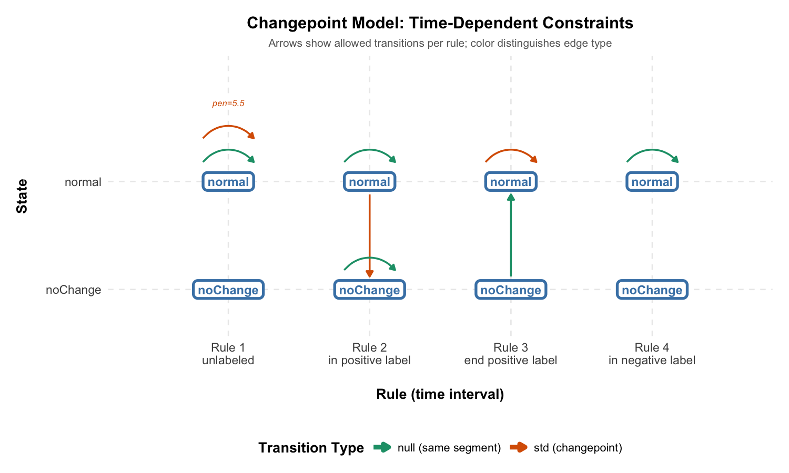
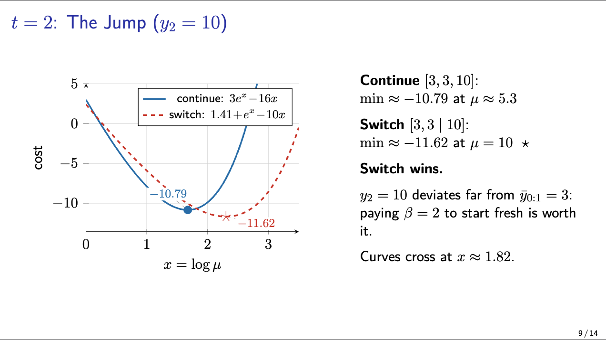
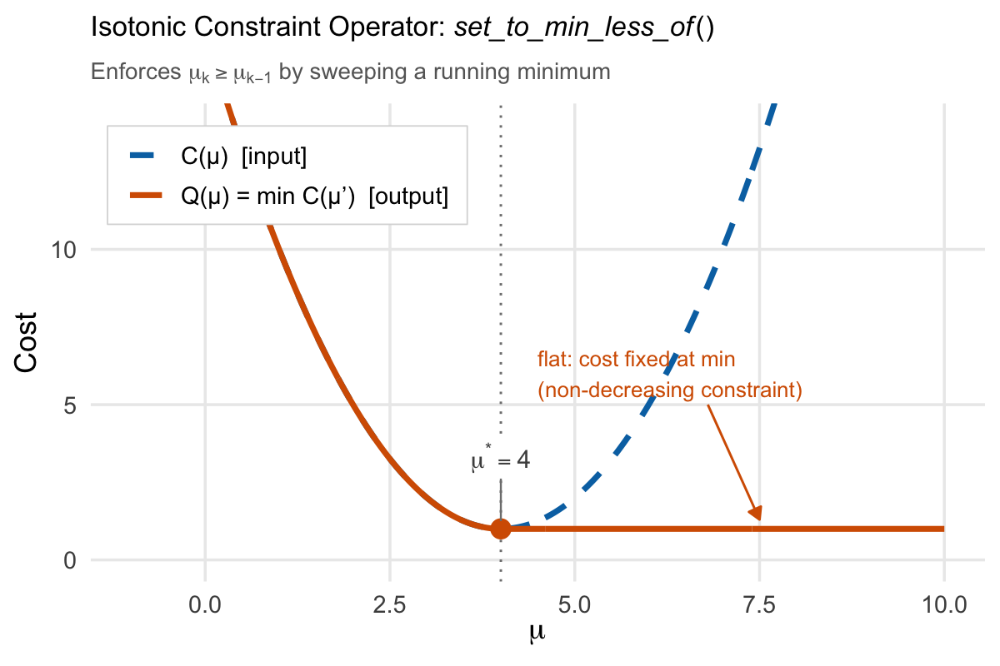

```{r setup, include=FALSE}
knitr::opts_chunk$set(
  echo = FALSE,
  warning = FALSE,
  message = FALSE,
  fig.align = "center",
  out.width = "85%"
)
```

\vspace{-1cm}

\newpage

# Logistics

## Project Info

- **Project title:** Time-Dependent Constraints in gfpop
- **Project short title:** Time-dep constraints in gfpop
- **Project size:** Large (350 hours)
- **URL of project idea page:**\
  <https://github.com/rstats-gsoc/gsoc2026/wiki/time-dependent-constraints-in-gfpop>

## Contact Information

- **Contributor name:** Weidong "William" Zhang
- **Postal address:** T3L 1Z3
- **Telephone:** (825) 365-2426
- **Email:** <weidongzhang60@gmail.com>
- **GitHub:** [\@williamzhang7792](https://github.com/williamzhang7792)
- **LinkedIn:** [weidong-william-zhang](https://www.linkedin.com/in/weidong-william-zhang)
- **Discord username:** weidong.z

## Contributor Affiliation

- **Institution:** University of Waterloo
- **Program:** Bachelor of Mathematics, Statistics major, Computing minor
- **Stage of completion:** Second year
- **Contact to verify:** <mathuo@uwaterloo.ca>

## Schedule Conflicts

I will be taking 3--5 summer courses at my university, depending on
offerings. I have no other jobs, internships, or commitments.
I plan to dedicate approximately 25--35 hours per week to GSoC alongside my
coursework, with heavier weeks (35+) in June before course deadlines
peak and lighter weeks (25) in August. To compensate for the split
workload, I plan to front-load work during the community bonding
period (R-side API, design doc, dev environment) so that coding starts
with a running head start.

## Mentors

- **Evaluating mentor:**
    - Vincent Runge, <vincent.runge@univ-evry.fr>
- **Co-mentors:**
    - Toby Dylan Hocking, <tdhock5@gmail.com>
    - Gaetano Romano, <g.romano@lancaster.ac.uk>

**Have you been in touch with the mentors? When and how?**

Yes. I have been in contact with all three mentors via email and GitHub
since late February 2026.

- **Feb \textasciitilde 24:** Emailed Vincent Runge (CC'd Toby Hocking
  and Gaetano Romano) introducing myself and sharing completed Easy,
  Medium, and Hard test results. Asked for feedback on my understanding
  of the FPOP algorithm.
- **Feb \textasciitilde 26:** Toby reviewed the test results and gave
  feedback on code readability (unicode escapes in R). He pointed out
  that the solvers should be integrated into a proper PeakSegOptimal
  fork rather than standalone scripts, and suggested I begin the GSoC
  application. I refactored both solvers into the fork and updated Toby
  on March 2.
- **Mar \textasciitilde 10:** Toby suggested I submit a PR so the diff
  could be reviewed. Opened
  \href{https://github.com/tdhock/PeakSegOptimal/pull/24}{PR \#24}
  (add unconstrained Poisson FPOP and isotonic Normal FPOP solvers) on
  PeakSegOptimal.
- **Mar 11--27:** Opened
  \href{https://github.com/tdhock/PeakSegOptimal/pull/25}{PR \#25}
  to migrate CI from Travis to GitHub Actions. Over the course of
  several iterations, Toby helped me work through CI configuration, R
  packaging practices (\texttt{Suggests}, \texttt{Remotes},
  \texttt{extra-packages}), test dependency management for archived
  CRAN packages, and a cache invalidation issue caused by an Ubuntu
  runner update. PR **merged** on Mar 27.
- **Mar \textasciitilde 15:** Emailed Vincent directly with the draft
  proposal. Vincent responded with technical feedback: the
  $O(n \log n)$ complexity claim for FPOP/GFPOP is not proven (he
  prefers ``quasi-linear''), and backtracking under constraints is a
  known difficulty. I incorporated both points into the proposal.

The review process has been a good learning experience. Through
\href{https://github.com/tdhock/PeakSegOptimal/pull/25}{PR~\#25}, I picked up practical R packaging knowledge (how
\texttt{setup-r-dependencies} resolves \texttt{Suggests}, how
\texttt{Remotes} interacts with CRAN checks) that I would not have
learned from the documentation alone. Also, thanks to Vincent's
feedback, I was able to improve the technical claims in the proposal.

\newpage

## Qualification Tests \label{sec:tests}

All three tests completed, as described on the
\href{https://github.com/rstats-gsoc/gsoc2026/wiki/time-dependent-constraints-in-gfpop}{project wiki}.
Code is in the
\href{https://github.com/williamzhang7792/gsoc2026-gfpop-william-zhang}{test repository};
both solvers are also integrated into a
\href{https://github.com/williamzhang7792/PeakSegOptimal}{PeakSegOptimal fork}.

### plotModel(graph) Visualization (Easy Test)

I wrote an R function that takes a gfpop graph with a \texttt{rule}
column and draws it as a state-by-rule transition matrix using ggplot2.
Rows are states, columns are rules, arrows show allowed transitions.
Self-loops are stacked vertically and edges are shortened to avoid
label overlap.

This visualization already models the API extension. The
\texttt{plotModel()} output in the R API section was generated by
this function.

```{r plotmodel-test, fig.cap="plotModel() output from the Easy test: LOPART graph with 4 rules and 2 states."}

```

### Unconstrained FPOP (Medium Test)

I adapted PeakSegOptimal's 2-state constrained solver into a 1-state
unconstrained solver for optimal partitioning with Poisson loss. The
key insight was replacing \texttt{set\_to\_min\_less\_of} /
\texttt{set\_to\_min\_more\_of} with a new
\texttt{set\_to\_unconstrained\_min\_of} that collapses the cost to a
single flat piece at the global minimum.

- 9 testthat tests, oracle-validated against
  \texttt{Segmentor3IsBack::Segmentor(model=1)} across multiple
  penalties (replacing with \texttt{gfpop::gfpop()} per mentor
  feedback in \href{https://github.com/tdhock/PeakSegOptimal/pull/25}{PR~\#25}).
- Integrated into the PeakSegOptimal fork with C registration,
  \texttt{.C()} interface, and 28 tests.
- Prepared a
  \href{https://github.com/williamzhang7792/gsoc2026-gfpop-william-zhang/blob/main/2_medium/algo.pdf}{slide deck}
  walking through FPOP pruning mechanics.

```{r pruning-demo, fig.cap="FPOP pruning trace from the Medium test, showing the number of piecewise cost function intervals over time.", out.width="65%"}

```

### Regularized Isotonic Regression (Hard Test)

I implemented \texttt{NormalLossPiece} with closed-form quadratic
roots (no Newton iteration needed, unlike the Poisson case). Both
\texttt{NormalLossPiece} and \texttt{PoissonLossPieceLog} inherit from
a shared \texttt{LossPiece} base class, which is directly relevant to
gfpop's multi-loss architecture.

I also reconstructed \texttt{set\_to\_min\_less\_of} from first
principles in a standalone setting. This is the core operator behind
the isotonic constraint, and the same one that will enforce
up-constraints in the time-dependent extension.

- 14+ testthat tests including a 200-trial fuzz test against
  \texttt{isoreg()} (PAVA).
- \texttt{penalty=0} matches \texttt{isoreg}; positive penalty matches
  \texttt{fpop::Fpop()} on non-decreasing data.

```{r min-less-of, fig.cap="Visualization of the set\\_to\\_min\\_less\\_of operator from the Hard test. The blue curve is the original piecewise quadratic cost; the red curve is the running minimum.", out.width="55%"}

```

\newpage

# Project Plan

## Overview

The \texttt{gfpop} package (Runge et al., 2020) unifies a wide family
of constrained changepoint problems (isotonic regression, up-down peak
detection, and more) through a single graph abstraction. Combined with
the FPOP pruning strategy (Maidstone et al., 2017), this yields an
empirically quasi-linear solver that is both general and fast.

But the graph is \emph{time-independent}: the same edges apply at every
data point. This means gfpop cannot express models like LOPART (Hocking
and Srivastava, 2022), where the allowed transitions depend on whether
the current observation falls inside a labeled region. Today, R packages
for changepoint detection split into two categories: domain-specific
solvers (LOPART, FLOPART) that handle labels but only for one model,
and generic frameworks (gfpop) that handle many models but not labels.

The extension to close this gap is small and surgical. A
rule function $r: \{1, \ldots, N\} \to \{1, \ldots, R\}$ selects which
subset of edges is active at each time step. The R API changes are
minimal (one new parameter on \texttt{Edge()}, one new argument to
\texttt{gfpop()}). The C++ changes are concentrated in a single loop
but require careful infinity handling and edge-sort invariant
preservation. Once in place, gfpop can express both LOPART and models
that no current package can handle, like up-down peak detection with
label constraints. For the R ecosystem, this means any future labeled
changepoint model can be expressed in gfpop without writing a new
package from scratch.

I have completed all three qualification tests (Easy, Medium, and
Hard), as recommended by the project wiki: an unconstrained FPOP
solver (Poisson loss), a regularized isotonic regression solver (Normal
loss), and a rule-aware graph visualizer. That is roughly 1,200 lines of
C++ exercising every component this extension will touch: the DP loop,
the constraint operators, the min-envelope, and the backtracking.

I'm interested in this project because it involves some serious
algorithm design and real scientific applications. Also, being able to
ship something inside a mature CRAN package is quite cool.

## gfpop Architecture \label{architecture}

Before diving into the limitation and the fix, it helps to see how gfpop
is structured.

\begin{figure}[H]
\centering
\scalebox{0.85}{%
\begin{tikzpicture}[
  node distance=0.6cm and 1.2cm,
  box/.style={draw, rounded corners, minimum height=0.7cm,
              minimum width=2.2cm, align=center, font=\small},
  highlight/.style={box, draw=red!70!black, line width=1.2pt, fill=red!6},
  arr/.style={-{Stealth[length=2.5mm]}, thick},
  lbl/.style={font=\footnotesize\itshape, text=gray!70!black}
]

% R layer
\node[box] (api)
  {Edge(), graph()\\[-2pt]Node(), StartEnd()};
\node[box, right=of api] (reorder)
  {graphReorder()};
\node[box, right=of reorder] (bridge)
  {gfpopTransfer()\\[-2pt]{\footnotesize Rcpp bridge}};

% C++ layer
\node[highlight, below=1.2cm of bridge] (step1)
  {\texttt{LP\_edges\_operators(t)}\\[-2pt]
   {\footnotesize\color{red!70!black} modification target}};
\node[box, below=of step1] (step2)
  {\texttt{LP\_edges\_add...()}};
\node[box, below=of step2] (step3)
  {\texttt{LP\_t\_new\_multiple...()}};
\node[box, below=1.0cm of step3] (back)
  {backtracking()};

% Arrows
\draw[arr] (api) -- (reorder);
\draw[arr] (reorder) -- (bridge);
\draw[arr] (bridge) -- (step1);
\draw[arr] (step1) -- (step2);
\draw[arr] (step2) -- (step3);
\draw[arr] (step3) -- (back);

% Layer labels
\node[lbl, left=0.6cm of api] {R};
\node[lbl, left=0.6cm of step1] {C++};

% DP loop brace
\draw[decorate, decoration={brace, amplitude=6pt, mirror},
      thick, gray!60]
  ([xshift=-0.4cm]step1.north west) -- ([xshift=-0.4cm]step3.south west)
  node[midway, left=0.45cm, lbl, align=right]
  {DP loop\\per data\\point};

% Loop-back arrow
\draw[arr, gray!50] ([xshift=0.4cm]step3.east)
  -- ++(0.6,0) |- ([xshift=0.4cm]step1.east);
\node[lbl, right=1.9cm of step2] {$t = 1 \ldots n$};

\end{tikzpicture}%
}
\caption{gfpop pipeline from R to C++. The highlighted box is the
single modification target for time-dependent constraints.}
\label{fig:architecture}
\end{figure}

The pipeline:

1. The user constructs a graph via \texttt{graph()}, \texttt{Edge()},
   \texttt{Node()}, \texttt{StartEnd()}.
2. \texttt{graphReorder()} sorts edges by \texttt{(state2, penalty)}
   and converts state names to 0-based integers.
3. \texttt{gfpopTransfer()} (the Rcpp bridge) reads the graph into
   C++ \texttt{Edge}/\texttt{Graph} objects and sets up the cost
   function dispatch via global function pointers.
4. \texttt{Omega::gfpop()} runs the DP with three steps per data point:
   \texttt{LP\_edges\_operators(t)} applies constraint operators to
   each edge's source cost function;
   \texttt{LP\_edges\_addPointAndPenalty()} adds the data point cost
   and edge penalty;
   \texttt{LP\_t\_new\_multipleMinimization(t)} takes the pointwise
   minimum across all incoming edges for each destination state.

The edge sort invariant (edges sorted by \texttt{(state2, penalty)}) is
exploited by step 4's minimization: it walks the edge array in order,
processing all edges targeting the same state in one contiguous block.
If edges with the same target state are not adjacent, this walk
breaks. Any time-dependent filtering must preserve this invariant.

## The Problem: Why gfpop Cannot Express Label Constraints

### A Concrete Scenario

Consider a genomics researcher analyzing ChIP-seq data. They have
expert-labeled regions indicating where peaks should (positive labels)
and should not (negative labels) appear. They want a changepoint model
that respects these labels, a model where the set of allowed transitions
depends on the current position in the data. The LOPART package can do
this, but only for Gaussian loss with no up-down constraints. gfpop can
handle arbitrary losses and graph constraints, but not labels.

The
\href{https://github.com/rstats-gsoc/gsoc2026/wiki/time-dependent-constraints-in-gfpop}{project
wiki page} frames this as the central gap: gfpop's graph is static, but
real-world models need edges that switch on and off depending on context.

### The Fragmented Landscape

The table below (adapted from Kaufman et al., 2024) maps the current
algorithm landscape. No single generic framework handles both label
constraints and up-down constraints:

\begin{table}[H]
\centering
\small
\begin{tabular}{lccl}
\toprule
\textbf{Algorithm} & \textbf{Labels} & \textbf{Up-down} & \textbf{Time} \\
\midrule
OPART (Jackson et al., 2005)        & No  & No  & $O(n^2)$ \\
LOPART (Srivastava \& Hocking, 2023) & Yes & No  & $O(n^2)$ \\
FPOP (Maidstone et al., 2017)       & No  & No  & quasi-linear$^*$ \\
GFPOP (Runge et al., 2020)          & No  & Yes & quasi-linear$^*$ \\
FLOPART (Kaufman et al., 2024)      & Yes & Yes & quasi-linear$^*$ \\
\bottomrule
\end{tabular}
\vspace{0.2em}

{\footnotesize $^*$Empirically quasi-linear; worst-case $O(n^2)$ since pruning is not guaranteed.}
\caption{Algorithm landscape for changepoint detection (adapted from
Kaufman et al., 2024, Table~1). GFPOP is the most general framework but
cannot use labels; LOPART uses labels but has no up-down constraints and
runs in $O(n^2)$. FLOPART bridges the gap, but only for one model.}
\label{tab:landscape}
\end{table}

As Kaufman et al.\ (2024) write: ``The current fastest constrained algorithm,
GFPOP, can be considered unsupervised because the algorithm does not use
the labels in the train set, allowing for train errors. In contrast,
changepoint models that currently utilize labels are all unconstrained
models.'' The FLOPART CRAN vignette demonstrates this empirically: on
labeled ChIP-seq data, every unlabeled model, regardless of penalty,
produces either false positives or false negatives. Only the labeled
model achieves zero label errors.

**Why not just use FLOPART?** FLOPART solves one specific model:
Poisson loss with up-down constraints and labels. It is a standalone
C++ solver, not part of gfpop's graph framework. Any new combination
(Gaussian loss with isotonic constraints and labels, Huber loss with
up-down constraints and labels) would require writing yet another
standalone solver from scratch. The
\href{https://github.com/rstats-gsoc/gsoc2026/wiki/time-dependent-constraints-in-gfpop}{project
wiki page} frames this clearly: ``Existing R packages fall into two
categories: domain-specific packages such as LOPART \ldots{} generic
frameworks such as gfpop \ldots{} (but do not allow time dependent
constraints).'' Adding time-dependent constraints to gfpop means every
future model gets labels for free. One extension instead of $N$
standalone solvers.

### The Current gfpop Objective

The gfpop framework minimizes (see Runge et al., 2020 for full
derivation):

$$
Q_n = \min_{\substack{p \in \mathcal{G}_n \\ \mu \mid p(\mu)}}
\sum_{t=1}^{n} \left[ \gamma_{e_t}(y_t, \mu_t) + \beta_{e_t} \right]
$$

In words: find the path through the constraint graph and the segment
means that minimize total loss plus total penalty. Here
$\mathcal{G}_n$ is the set of valid paths through a \emph{collapsed}
constraint graph $G$, $\gamma_{e_t}$ is the loss function on edge
$e_t$, $\beta_{e_t} \geq 0$ is the penalty, and the indicator
constraints $I_{e_t}(\mu_t, \mu_{t+1}) = 1$ enforce relationships
between consecutive segment means (e.g., non-decreasing for "up"
edges).

The key limitation: the same graph $G$ applies at every time step $t$.

### The LOPART Objective

LOPART extends optimal partitioning by restricting the set of candidate
last-changepoints $T_t$ at each time step based on label positions (see
Srivastava and Hocking, 2023 for the full formulation). The update rule
has four cases depending on where data point $t$ falls:

- **Unlabeled:** $t{-}1$ is added as a changepoint candidate. The
  solver is free to place a change here or not.
- **Inside a positive label:** no new candidate is added. The solver
  cannot introduce a \emph{new} changepoint, but candidates from
  earlier time steps remain available.
- **End of a positive label:** the candidate set is reset to positions
  \emph{inside} the label, forcing at least one changepoint within it.
- **Inside a negative label:** no new candidate is added and the solver
  is blocked from placing any changepoint here.

Each case allows a different set of transitions. This is precisely a
time-dependent constraint, and gfpop cannot express it.

### The Gap in Code

In \texttt{Omega::LP\_edges\_operators(t)}
(\href{https://github.com/vrunge/gfpop/blob/master/src/Omega.cpp}{\texttt{src/Omega.cpp}}),
gfpop iterates over \emph{all} edges at \emph{every} time step:

```cpp
for (unsigned int i = 0; i < q; i++) {
  LP_edges[i].LP_edges_constraint(
    LP_ts[t][m_graph.getEdge(i).getState1()],
    m_graph.getEdge(i), t);
}
```

This is the single point in the codebase that makes gfpop
time-independent (see Figure~\ref{fig:architecture}). The entire
project reduces to making this loop conditional on the current time
step.

## The Extension: A Rule Function

The extension is minimal: instead of applying all edges at every time
step, apply only the subset that matches the current data point's rule.

**Definition.** Define a rule function
$r: \{1, \ldots, n\} \to \{1, \ldots, R\}$ that maps each data point
to a rule ID. Partition the edge set into $R$ subsets
$E_1, \ldots, E_R$, where each edge belongs to the subset corresponding
to its rule ID. Edges with rule = NA belong to \emph{all} subsets
(backward compatibility).

**The modified DP.** Let $O^{s,s'}_t(\theta)$ denote the result of
applying the constraint operator of edge $(s,s')$ (up, down, or
identity) to the cost function $Q^s_t$. The update equation becomes
(see Runge et al., 2020 for the standard gfpop formulation):

$$
Q^{s'}_{t+1}(\theta) = \min_{s : (s,s') \in E_{r(t+1)}}
\left\{ O^{s,s'}_t(\theta) + \gamma_{(s,s')}(y_{t+1}, \theta) + \beta_{s,s'} \right\}
$$

The only change from standard gfpop: the minimization is over
$E_{r(t+1)}$ instead of $E$.

**The infinity requirement.** When state $s'$ has no incoming active
edges under rule $r(t)$, the cost function must remain
$Q^{s'}_t(\theta) = +\infty$ for all $\theta$. Ensuring that the
infinity sentinel propagates correctly through gfpop's linked-list
cost functions is the hardest sub-problem of this project.
Section~\ref{sec:cpp} details exactly where infinity appears and how
each function handles it.

Per-step edge processing is $O(q_{\text{active}})$ instead of $O(q)$,
where $q$ is the total number of edges and
$q_{\text{active}} \leq q$ is the number active under the current
rule. The FPOP pruning behavior is unchanged, so empirical complexity
remains quasi-linear in $N$.

## What the User Sees: The R API

### Edge() Gains a rule Parameter

```r
gfpop::Edge("normal", "normal", type = "null", rule = 1)
gfpop::Edge("normal", "normal", type = "std",  rule = 1, penalty = 5.5)
```

Default: \texttt{rule = NA}, meaning the edge is active in all rules
(backward compatible with all existing gfpop code).

### gfpop() Gains a rule Argument

```r
gfpop::gfpop(data.vec, mygraph, type = "mean", rule = rule_vec)
```

The \texttt{rule\_vec} is an integer vector of length $N$, constructed
from the label annotations:

```r
LOPART.graph <- gfpop::graph(
  gfpop::Edge("normal",   "normal",   type = "null", rule = 1),
  gfpop::Edge("normal",   "normal",   type = "std",  rule = 1, penalty = 5.5),
  gfpop::Edge("normal",   "normal",   type = "null", rule = 2),
  gfpop::Edge("noChange", "noChange", type = "null", rule = 2),
  gfpop::Edge("normal",   "noChange", type = "std",  rule = 2, penalty = 5.5),
  gfpop::Edge("normal",   "normal",   type = "std",  rule = 3, penalty = 5.5),
  gfpop::Edge("noChange", "normal",   type = "null", rule = 3),
  gfpop::Edge("normal",   "normal",   type = "null", rule = 4),
  gfpop::StartEnd(start = "normal", end = "normal"))

# user-side code; gfpop itself does not depend on data.table
rule_vec <- data.table::fcase(
  unlabeled,          1L,
  in.positive.label,  2L,
  end.positive.label, 3L,
  in.negative.label,  4L)

result <- gfpop::gfpop(data.vec, LOPART.graph, type = "mean", rule = rule_vec)
```

### A Researcher's Workflow

The graph above encodes LOPART as 8 edges across 4 rules. The user
builds a rule vector from their labels, calls
\texttt{gfpop(..., rule = rule\_vec)}, and gets labeled-optimal
segments. No separate package, no format conversion, no loss-function
restriction. Figure~\ref{fig:filmstrip} shows how the active subgraph
changes as the data moves through labeled regions.

\begin{figure}[H]
\centering
\begin{tikzpicture}[
  state/.style={circle, draw, minimum size=0.8cm, font=\footnotesize\bfseries},
  sN/.style={state, fill=blue!8, draw=blue!50!black},
  sC/.style={state, fill=orange!8, draw=orange!50!black},
  active null/.style={-{Stealth[length=2mm]}, thick, blue!60!black},
  active chg/.style={-{Stealth[length=2mm]}, thick, red!60!black},
  off/.style={-{Stealth[length=2mm]}, gray!30, dashed, thin},
  plbl/.style={font=\small\bfseries, text=gray!60!black},
  psub/.style={font=\tiny\itshape, text=gray!50!black},
  every loop/.style={min distance=7mm, looseness=7}
]

% Rule 1: Unlabeled
\begin{scope}[xshift=0cm]
  \node[plbl] at (0, 1.7) {Rule 1};
  \node[psub] at (0, 1.3) {Unlabeled};
  \node[sN] (n1) at (0, 0.2) {N};
  \node[sC] (nc1) at (0, -1.1) {nC};
  \draw[active null] (n1) edge[loop above] ();
  \draw[active chg] (n1) edge[loop right] ();
  \draw[off] (nc1) edge[loop below] ();
  \draw[off] (n1) edge[bend right=30] (nc1);
  \draw[off] (nc1) edge[bend right=30] (n1);
\end{scope}

% Rule 2: In positive label
\begin{scope}[xshift=3.5cm]
  \node[plbl] at (0, 1.7) {Rule 2};
  \node[psub] at (0, 1.3) {Positive label};
  \node[sN] (n2) at (0, 0.2) {N};
  \node[sC] (nc2) at (0, -1.1) {nC};
  \draw[active null] (n2) edge[loop above] ();
  \draw[active null] (nc2) edge[loop below] ();
  \draw[active chg] (n2) edge[bend right=30] (nc2);
  \draw[off] (nc2) edge[bend right=30] (n2);
\end{scope}

% Rule 3: End of positive label
\begin{scope}[xshift=7cm]
  \node[plbl] at (0, 1.7) {Rule 3};
  \node[psub] at (0, 1.3) {End positive};
  \node[sN] (n3) at (0, 0.2) {N};
  \node[sC] (nc3) at (0, -1.1) {nC};
  \draw[active chg] (n3) edge[loop above] ();
  \draw[off] (nc3) edge[loop below] ();
  \draw[off] (n3) edge[bend right=30] (nc3);
  \draw[active null] (nc3) edge[bend right=30] (n3);
\end{scope}

% Rule 4: Negative label
\begin{scope}[xshift=10.5cm]
  \node[plbl] at (0, 1.7) {Rule 4};
  \node[psub] at (0, 1.3) {Negative label};
  \node[sN] (n4) at (0, 0.2) {N};
  \node[sC] (nc4) at (0, -1.1) {nC};
  \draw[active null] (n4) edge[loop above] ();
  \draw[off] (nc4) edge[loop below] ();
  \draw[off] (n4) edge[bend right=30] (nc4);
  \draw[off] (nc4) edge[bend right=30] (n4);
\end{scope}

\end{tikzpicture}
\caption{The LOPART graph under each rule. Blue arrows are null (stay)
edges; red arrows are change edges. Dashed gray edges are inactive under
that rule. As the data moves through labeled regions, different edges
switch on and off.}
\label{fig:filmstrip}
\end{figure}

### Notes on Compatibility and Validation

**Backward compatibility.** When \texttt{rule} is omitted, all edges are
active at all times: current behavior is preserved. The \texttt{rule}
column in the graph defaults to NA; NA-rule edges are always active.
Existing user code is unaffected.

**Input validation.** \texttt{length(rule)} must equal
\texttt{length(data)}. Rule IDs in \texttt{rule} must be a subset of
rule IDs in the graph. \texttt{graphReorder()} must preserve the
\texttt{rule} column and maintain the sort invariant within each rule
group. The \texttt{weights} argument is independent of the rule vector
(weights affect the loss, rules affect which edges are active), so no
interaction is expected. Label boundary transitions (e.g., a positive
label ending at $t$ followed by a negative label at $t{+}1$) are
handled by the rule vector, which assigns exactly one rule per data
point. R-side validation will check that rule assignments cover all
label boundaries without gaps or overlaps.

**plotModel() already visualizes this.** The \texttt{plotModel()}
function from my Easy test already visualizes a rule-partitioned graph
as a state-by-rule transition matrix:

```{r plotmodel-output, fig.cap="plotModel() output for the LOPART graph above (same as Figure 1).", out.width="70%"}

```

\needspace{6cm}

## What the Solver Does: C++ Implementation \label{sec:cpp}

The C++ changes touch five files. The core modification is a
conditional in \texttt{Omega.cpp}; the other changes support it.

### Edge.h: Add ruleID

Add an \texttt{unsigned int ruleID} field and \texttt{getRuleID()}
getter to the \texttt{Edge} class. The constructor reads it from the R
data frame's \texttt{rule} column. Edges with \texttt{rule = NA} receive
a sentinel value (\texttt{UINT\_MAX}) meaning "always active."

### Graph.h: Precomputed Rule-to-Edge Lookup

Two design options:

- **Option A (simple):** At each time step, loop over all $q$ edges and
  check \texttt{edge.getRuleID() == rule\_vec[t]}. $O(q)$ per step.
- **Option B (precomputed):** At construction, build a
  \texttt{std::vector<std::vector<unsigned int>{}>{}} mapping each
  rule ID to its sorted edge indices. At each time step, iterate only over
  \texttt{rule\_to\_edges[rule\_vec[t]]}. $O(\text{active edges})$ per
  step.

I plan to start with Option A to validate the algorithm immediately,
then profile. For the LOPART model ($q = 8$), an 8-iteration loop
with a branch is likely faster than indexing a
\texttt{std::vector<std::vector<unsigned int>{}>{}>{}}. If profiling
shows per-step overhead at larger $q$, Option B can be added as a
targeted optimization. Either way, the lookup must preserve the
\texttt{(state2, penalty)} sort order within each rule group so that
\texttt{LP\_t\_new\_multipleMinimization} continues to work correctly
(it walks the edge array by target state; non-contiguous groups would
break this walk).

### Omega.cpp: LP\_edges\_operators(t), the Key Change

The modified function has three phases: (1)~reset all edge cost
functions, (2)~apply constraint operators to active edges only,
(3)~set remaining edges to the infinity sentinel.

```cpp
// BEFORE (current gfpop)
for (unsigned int i = 0; i < q; i++) {
  LP_edges[i].LP_edges_constraint(
    LP_ts[t][m_graph.getEdge(i).getState1()],
    m_graph.getEdge(i), t);
}

// AFTER (with time-dependent rules)
for (unsigned int i = 0; i < q; i++)
  LP_edges[i].reset();                        // deallocate old list
const auto& active = m_graph.activeEdges(rule_vec[t]);
for (unsigned int idx : active) {
  Edge const& edge = m_graph.getEdge(idx);
  LP_edges[idx].LP_edges_constraint(          // reset() inside is a no-op
    LP_ts[t][edge.getState1()], edge, t);
}
for (unsigned int i = 0; i < q; i++) {        // set remaining to infinity
  if (LP_edges[i].head == NULL)
    LP_edges[i].addFirstPiece(
      new Piece(Track(), interval, infinityCost));
}
```

Reset all edges first, then process only the active ones. Since
\texttt{LP\_edges\_constraint} calls \texttt{reset()} internally, the
second reset is a no-op (head is already NULL). The final loop sets
unprocessed edges to the infinity sentinel. This avoids the
double-allocation that would occur if \texttt{setInfinite()} allocated
a piece only for \texttt{LP\_edges\_constraint} to immediately
deallocate it. For larger graphs an alternative is to carry an
\texttt{isActive} flag and skip inactive edges in all three DP
sub-steps, avoiding allocation entirely. I plan to profile both
approaches.

### Omega.cpp: LP\_t\_new\_multipleMinimization(t)

No structural change needed. The current code walks edges sorted by
\texttt{state2} and takes the pointwise minimum via
\texttt{LP\_ts\_Minimization}. Since \texttt{LP\_ts[t+1][j]} is
initialized to $+\infty$ and inactive \texttt{LP\_edges} are also
infinite, the \texttt{isInfinite()} short-circuit in
\texttt{LP\_ts\_Minimization} will skip them. States with no active
incoming edges naturally retain their infinite cost.

If all incoming edges for a state are inactive, the precomputed
rule-to-edge lookup can detect this and skip the state entirely,
avoiding repeated infinity-vs-infinity comparisons.

### ListPiece.cpp: Infinity Handling in LP\_ts\_Minimization

Inactive edges are skipped in \texttt{LP\_edges\_operators}. In the
proposed models, the rule design ensures that \texttt{operatorUp} and
\texttt{operatorDw} are only applied to edges with reachable source
states. As a safety measure, I plan to add an \texttt{isInfinite()}
guard in these operators as well (FLOPART's C++ source uses a similar
short-circuit before each operator call). The simpler operators
(null = copy,
std = global-min) can see infinite source states and handle them
trivially ($\text{copy}(\infty) = \infty$;
$\min(\infty) = \infty$). The infinity sentinel therefore only
requires careful handling in two places:

1. \texttt{LP\_ts\_Minimization}: merges an infinite
   \texttt{LP\_edges[k]} with a finite \texttt{LP\_ts[t+1][j]} (or
   vice versa). Must return the finite side unchanged.
2. \texttt{LP\_edges\_addPointAndPenalty}: adds a data point cost to an
   infinite \texttt{LP\_edges[i]}. For standard losses ($K = \infty$),
   the existing code adds finite values to the infinite cost constant,
   which stays infinite. For robust losses ($K \neq \infty$), the code
   performs interval root-finding that could produce NaN on an infinite
   cost. An \texttt{isInfinite()} short-circuit is needed for this
   path.

Add an \texttt{isInfinite()} predicate on \texttt{ListPiece} and
short-circuit at the top of each function: if the incoming list is
infinite, return immediately without modifying the target. This avoids
pointer arithmetic on the sentinel piece and guards against
root-finding on infinite costs.

An alternative design is to skip inactive edges in
\texttt{LP\_edges\_addPointAndPenalty} as well (using the same active
set), which eliminates the need for infinity handling there entirely.
I plan to prototype both approaches and benchmark them.

### main.cpp: gfpopTransfer() Bridge

Read the \texttt{rule} column from the graph DataFrame (as
\texttt{IntegerVector}) and the \texttt{rule} argument from the function
call. Pass both to the \texttt{Omega} constructor. If \texttt{rule} is
not provided (R's default \texttt{NULL}), construct a vector of zeros and
mark all edges as belonging to rule 0.

## Obstacles and Challenges {#obstacles}

**Infinity handling in the min-envelope.**
The infinity sentinel analysis in Section~\ref{sec:cpp} identifies
\texttt{LP\_ts\_Minimization} and
\texttt{LP\_edges\_addPointAndPenalty} as the two functions that need
an \texttt{isInfinite()} short-circuit. I plan to write isolated test
cases for each with infinite inputs before integrating into the full
DP. Of the four obstacles below, infinity handling carries the most
risk (novel code in a complex linked-list library); the others follow
established modification patterns.

**Edge sort invariant.**
The global edge order must remain \texttt{(state2, penalty)} because
\texttt{LP\_t\_new\_multipleMinimization} walks edges sequentially by
\texttt{state2}. Changing the sort to \texttt{(rule, state2, penalty)}
would split same-\texttt{state2} edges across rule groups, breaking
this walk. Instead, \texttt{graphReorder()} keeps its current sort.
The rule-to-edge lookup stores indices into the global array, grouped
by rule. Each rule group's indices are already in
\texttt{(state2, penalty)} order because they are a subset of the
globally sorted array.

**Backtracking through rule transitions.**
Backtracking under constraints is a known difficulty in constrained
FPOP (flagged by Vincent Runge as well). The current backtracking code
in \texttt{Omega::backtracking()} calls
\texttt{m\_graph.findBeta(state1, state2)} to recover the edge
penalty at each step, looking up a unique edge by state pair. With
rules, the same state pair can carry different penalties in different
rules (e.g., \texttt{normal}$\to$\texttt{normal} has $\beta = 5.5$ in
Rule~1 but $\beta = 0$ in Rule~3). Two options:
(a)~extend \texttt{findBeta} to accept a rule ID, recoverable via
\texttt{rule\_vec[t]} since the \texttt{Track} already stores the time
step~$t$; or (b)~store the edge penalty directly in \texttt{Track},
avoiding the lookup entirely. I plan to study how FLOPART handles its
backtracking step before committing to an approach, and will discuss
the trade-offs with the mentors early in the community bonding period.

**Contingency.**
If the 6-rule up-down model stalls, the fallback is clear: ship the
4-rule LOPART model with full test coverage and benchmarks, and document
the 6-rule design for a follow-up PR.

\needspace{6cm}

## Deliverables and Validation

### LOPART in gfpop (4 Rule IDs, 2 States) {#lopart-model}

States: \texttt{normal}, \texttt{noChange}. Each rule corresponds to a
label context:

\begin{table}[H]
\centering
\small
\begin{tabular}{clp{8cm}}
\toprule
\textbf{Rule} & \textbf{Label Context} & \textbf{Active Edges} \\
\midrule
1 & Unlabeled &
  normal $\to$ normal (null),
  normal $\to$ normal (std + penalty) \\
2 & In positive label &
  normal $\to$ normal (null),
  noChange $\to$ noChange (null),
  normal $\to$ noChange (std + penalty) \\
3 & End of positive label &
  normal $\to$ normal (std + penalty),
  noChange $\to$ normal (null) \\
4 & In negative label &
  normal $\to$ normal (null) only \\
\bottomrule
\end{tabular}
\caption{LOPART rule structure: 2 states $\times$ 4 rules.
See Figure~\ref{fig:plotmodel-output} for the plotModel() visualization.}
\label{tab:lopart-rules}
\end{table}

**Why this encoding reproduces LOPART.** The \texttt{noChange} state
tracks whether a changepoint has occurred inside the current positive
label. During a positive label (Rule 2), the only way to reach
\texttt{noChange} is via a changepoint from \texttt{normal}. At the
label boundary (Rule 3), \texttt{noChange} $\to$ \texttt{normal}
(null) carries the post-change cost forward, while
\texttt{normal} $\to$ \texttt{normal} (std) forces a change for paths
that haven't changed yet. Either way, at least one changepoint occurs
inside every positive label, matching LOPART's $T_t$ reset. In
negative labels (Rule 4), only the null self-loop is active, so no
changepoint can occur. The formal equivalence will be verified by
oracle testing.

**Validation:** Oracle test against \texttt{LOPART::LOPART()}. On shared
test data (Gaussian loss, same penalty), the gfpop output with rule
vector must exactly match LOPART's output: same segments, same means,
same cost.

### Up-Down with Labels (6 Rule IDs, 4 States) {#updown-model}

States: \texttt{Up}, \texttt{Dw}, \texttt{noChangeUp} (nCU),
\texttt{noChangeDw} (nCD). The graph requires
\texttt{StartEnd(start = c("Up","Dw"), end = c("Up","Dw"))} so that
nCU and nCD begin at infinite cost (unreachable until a change occurs
inside a positive label). This model does not exist in any current R
package. gfpop would be the first to support it.

The 6 rules arise from splitting label contexts to avoid operating on
infinite-cost functions at unreachable states. This is a deliberate
design choice: instead of relying on correct infinity arithmetic (the
hardest obstacle), the rule function prevents infinity from entering
the operators in the first place.

\begin{table}[H]
\centering
\small
\begin{tabular}{clp{7.5cm}}
\toprule
\textbf{Rule} & \textbf{Label Context} & \textbf{Active Edges} \\
\midrule
1 & Unlabeled &
  Up $\to$ Up (null),
  Dw $\to$ Dw (null),
  Dw $\to$ Up (up + pen),
  Up $\to$ Dw (down + pen) \\
2 & First pt.\ of positive label &
  Up $\to$ Up (null),
  Dw $\to$ Dw (null),
  Dw $\to$ nCU (up + pen),
  Up $\to$ nCD (down + pen) \\
3 & Interior of positive label &
  Up $\to$ Up (null),
  Dw $\to$ Dw (null),
  nCU $\to$ nCU (null),
  nCD $\to$ nCD (null),
  Dw $\to$ nCU (up + pen),
  Up $\to$ nCD (down + pen) \\
4 & End of positive label &
  nCU $\to$ Up (null),
  nCD $\to$ Dw (null),
  Dw $\to$ Up (up + pen),
  Up $\to$ Dw (down + pen) \\
5 & Single-point positive label &
  Dw $\to$ Up (up + pen),
  Up $\to$ Dw (down + pen) \\
6 & In negative label &
  Up $\to$ Up (null),
  Dw $\to$ Dw (null) \\
\bottomrule
\end{tabular}
\caption{Up-down with labels: 4 states $\times$ 6 rules. Rules 2 and 5
deliberately exclude noChange self-loops to avoid infinity arithmetic.}
\label{tab:updown-rules}
\end{table}

Key design insight: in the standard up-down model, every changepoint is
a direction change (Up $\to$ Dw or Dw $\to$ Up). So requiring
\emph{at least one changepoint} in a positive label is equivalent to requiring
at least one direction change. Rule 4 exploits this: the only exits
from the Up/Dw states are direction changes, which is not an
over-constraint but a natural consequence of the up-down structure.

Rules 2 and 5 exclude noChange self-loops that would operate on
infinite-cost \texttt{ListPiece}s at unreachable states. Rule 3
includes these self-loops because by the interior of a positive label,
the noChange states may have been reached via a change transition. The
6-rule decomposition is my current best design; I'm curious whether the
mentors see a simpler formulation.

**Validation:** No oracle exists. Instead:

- Construct synthetic labeled genomic data with known peaks.
- Run gfpop with the 6-rule graph.
- Verify structural invariants: exactly one changepoint in each positive
  label region, zero changepoints in each negative label region.
- Compare unlabeled-region behavior against the standard gfpop up-down
  model (should match when all rules are set to the unlabeled rule).
- Hand-trace the 6-rule model on a small (5--10 point) dataset as
  part of the design doc, verifying cost optimality before writing
  code.

### Capstone Deliverable: Vignette and Visualization

A formal, user-facing R vignette that:

1. Introduces the problem: "You have labeled data. Here's how to use
   it with gfpop."
2. Walks through a genomic peak detection example with labels.
3. Shows the \texttt{plotModel()} visualization of the rule-partitioned
   graph.
4. Compares gfpop output with LOPART output on the same data.
5. Includes a **filmstrip plot**: a sequence of panels showing the active
   subgraph at representative time points (one per rule ID).

The filmstrip visualization will be a formal deliverable. I found that
the hardest part of learning gfpop was understanding which edges fire
when, and this is the diagram I wished existed.

### Testing and Benchmarking Strategy

Five layers of testing:

- **Oracle testing:** \texttt{gfpop(rule = LOPART\_graph)} vs
  \texttt{LOPART::LOPART()}: exact match on segments, means, and
  total cost across multiple test datasets and penalties.
- **Regression testing:** \texttt{gfpop()} without \texttt{rule}
  produces bit-identical results to current gfpop on the existing
  test suite.
- **Structural invariant testing:** For the up-down+labels model,
  verify exactly one changepoint per positive label region and zero
  per negative label region on synthetic data.
- **Fuzz testing:** Random data + random label positions, check that
  \texttt{gfpop(rule=...)} never crashes, produces NaN, or violates
  label constraints. 200+ trials.
- **Benchmarking:** \texttt{microbenchmark} comparing
  \texttt{gfpop(rule = LOPART)} vs standalone
  \texttt{LOPART::LOPART()} at $N = 10^3, 10^4, 10^5, 10^6$. Report
  median wall-clock time. Standalone LOPART has a tightly optimized
  loop for its specific model, so gfpop's general graph machinery may
  be slower by a constant factor. The goal is to quantify that overhead
  and confirm it stays within a reasonable range (e.g., $<$5x).

## Success Criteria and Non-Goals

### Core Goals (must deliver)

- \texttt{Edge(..., rule=)} parameter added to R API, backward compatible
- \texttt{gfpop(..., rule=)} parameter added, backward compatible
- C++ edge filtering by rule in \texttt{LP\_edges\_operators}
- Infinity handling in \texttt{LP\_ts\_Minimization} and
  \texttt{LP\_edges\_addPointAndPenalty}
- LOPART model (4 rules, 2 states) working in gfpop, oracle-validated
  against \texttt{LOPART::LOPART()}
- Regression tests: gfpop without \texttt{rule} produces identical
  results to current gfpop
- \texttt{R CMD check} passes with no new warnings

### Stretch Goals (if time permits)

- Up-down with labels (6 rules, 4 states) working in gfpop
- Performance benchmarks: \texttt{gfpop(rule=...)} vs standalone LOPART,
  $N = 10^3$ to $10^6$
- Capstone vignette with filmstrip visualization
- Design a FLOPART-equivalent model graph (Poisson loss, up-down
  constraints, labels). This is a model design task, not a C++ change.
- RLE compression of the rule vector for long constant-label runs

### Non-Goals

- **Not modifying the PDPA algorithm.** Only the FPOP (penalty-based)
  solver.
- **Not redesigning gfpop's cost function dispatch.** gfpop uses global
  function pointers rather than a class hierarchy. I will work within
  this pattern, not refactor it.

## Timeline

\begin{table}[H]
\centering
\small
\begin{tabular}{llp{7.5cm}r}
\toprule
\textbf{Phase} & \textbf{Week} & \textbf{Details} & \textbf{Hours} \\
\midrule
Pre-acceptance & Now -- Apr 30 & Communicate with mentors, study gfpop and FLOPART C++ source (especially infinity handling at label boundaries), prototype infinity sentinel & N/A \\
\midrule
Community Bonding & May 1--7 & Fork gfpop, set up dev environment, configure CI & N/A \\
 & May 8--14 & Write design doc with mentors' input, finalize API & N/A \\
 & May 15--24 & Implement \texttt{Edge(rule=)} and \texttt{graph(rule=)} on R side & N/A \\
\midrule
Part 1 & May 25--31 & Add \texttt{ruleID} to Edge, rule vector to Omega, precomputed lookup & 30 \\
 & Jun 1--7 & Edge filtering in \texttt{LP\_edges\_operators}, infinity sentinel & 30 \\
 & Jun 8--14 & Unit tests: infinity through operatorUp, operatorDw, min-envelope & 25 \\
 & Jun 15--21 & Build LOPART graph in R, extend backtracking for rule-aware \texttt{findBeta}, first end-to-end test & 30 \\
 & Jun 22--28 & Oracle tests against \texttt{LOPART::LOPART()}, debug & 35 \\
 & Jun 29--Jul 5 & Hardening: edge cases, backward compat. Midterm report & 30 \\
\midrule
 & \textbf{Jul 6--10} & \textbf{Midterm: LOPART model working, oracle tests passing} & \\
\midrule
Part 2 & Jul 6--12 & Design 6-rule up-down graph, enumerate edges per rule & 25 \\
 & Jul 13--19 & Implement up-down+labels, validate on synthetic data & 30 \\
 & Jul 20--26 & Test label constraint satisfaction, 4-state edge cases & 25 \\
 & Jul 27--Aug 2 & Performance benchmarks, begin capstone vignette & 25 \\
 & Aug 3--9 & Extend plotModel for 6-rule graph, filmstrip visualization & 20 \\
 & Aug 10--16 & Polish: man pages, comprehensive test suite (fuzz, large N) & 25 \\
 & Aug 17--24 & Final code review with mentors, address feedback, submit PR & 15 \\
\midrule
 & \textbf{Aug 17--31} & \textbf{Final evaluation} & \\
\midrule
\textbf{Total} & & & \textbf{$\sim$345} \\
\bottomrule
\end{tabular}
\end{table}

**Contingency:** The vignette and visualization weeks (Jul 27 -- Aug 9)
are buffer. If the core implementation takes longer, the vignette scope
shrinks but the algorithm ships. If ahead of schedule, extend to Poisson
loss with labels.

**If behind schedule:** The 6-rule up-down model becomes a stretch goal.
LOPART (4 rules) with full test coverage and benchmarks is the minimum
viable deliverable.

**Balancing coursework:** I will be taking summer courses alongside
GSoC. The community bonding period is deliberately front-loaded (fork,
CI, design doc, R-side API) so that Part 1 coding begins with
infrastructure already in place. The heavier coding weeks (30 hrs) are
in June before course deadlines peak; the lighter weeks (15--20 hrs) are
in August when I expect more exams.

## Management of Coding Project

- **Commits:** Daily pushes to a feature branch. PRs for each milestone:
  (1) R API + graphReorder, (2) C++ infrastructure + infinity,
  (3) LOPART model, (4) up-down model, (5) vignette.
- **CI:** \texttt{R CMD check} on GitHub Actions for every PR. The full
  testthat suite must pass before merge.
- **Communication:** Weekly status update to mentors via email or GitHub
  issue thread. If no commits for 3+ days, proactively flag blockers.
- **Code review:** Request mentor review at each milestone before
  proceeding to the next.
- **Red flag protocol:** If commits slow to fewer than 2 per week, or
  tests fail without quick fixes, escalate to mentors immediately.


\newpage

# About Me

## Bio

Hi! I'm William. I study Mathematics at the University of Waterloo,
Canada (Statistics major, Computing minor). At the core, I'm a stats
student, so I use R quite often.
I also work in actuarial science, currently interning at Intact
(previously at Pacific Life Re). But the part I keep coming back to is
the modeling.

At Intact, I got curious about usage-based insurance: telematics
pricing, where you're trying to figure out how someone's driving
behavior maps to their risk. That's a changepoint problem. You're
looking for the moment a driver's pattern shifts, a trend break in claim
frequency, an inflection point in how losses develop. The more I
explored the newer corners of actuarial work, the more I kept finding
problems that looked like constrained changepoint detection. That's how
I found gfpop.

This project makes sense to me. The extension is small and surgical,
but it lets gfpop express every labeled changepoint model. That's an
elegant payoff. On a personal level, it also connects to the applied
problems I care about. So ya, I want to build
this because it's cool, and because people like me would actually use it.

## Programming Languages and Tools

I picked up R through my statistics courses and C++ through my computing
minor. R is what I reach for first for anything statistics-related, and
C++ is what the qualification tests pushed me deeper into. I wrote roughly 1,200 lines across three solvers
(piecewise cost operators, linked-list manipulation, memory management),
I'm still learning C++, but the tests taught me to read an unfamiliar
numerical codebase, trace the logic, and get working changes into it.

On the R side, I'm comfortable with ggplot2, testthat,
Rcpp, and the CRAN development pipeline (NAMESPACE, \texttt{.C()}
interface, C registration, \texttt{R CMD check}).

Python, SQL, and Next.js come from the work side: internships at Intact
and Pacific Life Re, plus hackathons and a research project. And LaTeX
is what this proposal is written in.

## Skills I Picked Up

The qualification tests (see Section~\ref{sec:tests}) taught me a lot. Going in,
I knew some R and had a bit of C++ from coursework. Coming out, I had
a better sense of what it actually takes to work on numerical software.

The biggest lesson was learning to read someone else's C++ codebase.
PeakSegOptimal is roughly 3,000 lines with no tutorial. I spent a lot
of time tracing the DP loop and mapping out the flow before I changed
anything. Building a shared \texttt{LossPiece} base class for
\texttt{NormalLossPiece} and \texttt{PoissonLossPieceLog} gave me a
small taste of what gfpop's multi-loss architecture looks like from the
inside. That's the same skill I'll need for gfpop's \texttt{Omega},
\texttt{ListPiece}, and \texttt{Graph} classes.

I also learned that "it runs" is not the same as "it's correct."
Oracle tests (against \texttt{Segmentor3IsBack}, \texttt{isoreg()},
\texttt{fpop::Fpop()}) caught subtle off-by-one and boundary errors
that my unit tests missed entirely. Fuzz testing (200-trial randomized
inputs) surfaced edge cases I hadn't thought to check. I plan to use
both heavily for this project. And integrating everything into a
CRAN-ready package (C registration, \texttt{.C()} interface, testthat,
\texttt{R CMD check}) taught me the plumbing that papers never talk
about.

## What I Expect from GSoC

Mostly, I want to learn what it takes to ship real code into a package
that people actually use. I've written solvers on my own, but
contributing to someone else's codebase is different. Navigating existing
design decisions, writing code that a maintainer would actually want to
merge. The PR review process gave me a taste of that, and it's a skill I
haven't practiced enough.

I'm also curious about the research-to-software pipeline. The ideas
behind this extension already exist in papers (LOPART, FLOPART, gfpop),
but turning them into a clean, tested, backward-compatible
implementation involves decisions that papers never talk about. I want
to get better at making those calls.

Beyond this summer, I'd like to stay involved with gfpop. The
usage-based side of actuarial science, where I want to work, treats
changepoint detection as a recurring part of the modeling workflow, not
a one-off analysis. Staying close to gfpop means I'd be both building
the tool and using it. That feels like the right way to contribute.

That, and I really want to debug infinity propagation through operatorUp. It's quite cool.

\newpage

# References

- Jackson, B., Scargle, J.D., Barnes, D., Arabhi, S., Alt, A.,
  Gioumousis, P., Gwin, E., Sangtrakulcharoen, P., Tan, L., and
  Tsai, T.T. (2005). "An Algorithm for Optimal Partitioning of Data
  on an Interval." \emph{IEEE Signal Processing Letters}, 12(2),
  105--108.
- Kaufman, J.M., Stenberg, A.J., and Hocking, T.D. (2024). "Functional
  Labeled Optimal Partitioning." \emph{Journal of Computational and
  Graphical Statistics}.
  \url{https://doi.org/10.1080/10618600.2023.2293216}
- Maidstone, R., Hocking, T.D., Rigaill, G., and Fearnhead, P. (2017).
  "On Optimal Multiple Changepoint Algorithms for Large Data."
  \emph{Statistics and Computing}, 27(2), 519--533.
  \url{https://doi.org/10.1007/s11222-016-9636-3}
- Runge, V., Hocking, T.D., Romano, G., Afghah, F., Fearnhead, P., and
  Rigaill, G. (2020). "gfpop: an R Package for Univariate
  Graph-Constrained Change-point Detection."
  \url{https://arxiv.org/abs/2002.03646}
- Srivastava, A. and Hocking, T.D. (2023). "LOPART: Labeled Optimal
  Partitioning." \emph{Computational Statistics}, 38, 461--480.
  \url{https://doi.org/10.1007/s00180-022-01238-z}
- gfpop.
  \url{https://github.com/vrunge/gfpop}
- PeakSegOptimal.
  \url{https://github.com/tdhock/PeakSegOptimal}
